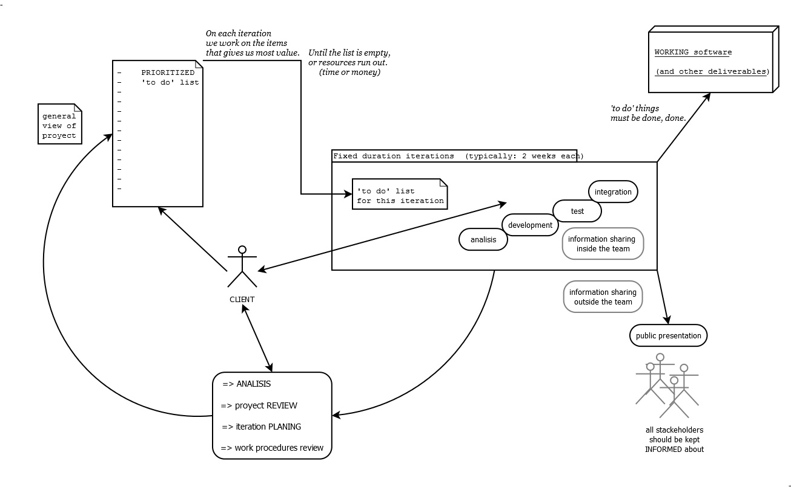

مقدمه
=======

* در عصر اطلاعات یا به عبارتی بهتر انفجار اطلاعات ، روزانه حجم بالایی از دانش و اطلاعات تولید شده و در دسترس همگان قرار می‌گیرد. دسترسی آسان به اینترنت و امکانات فراوان آن سبب روبرو شدن بشر با دریایی از اطلاعات گشته است. به طبع این اقیانوس عظیم دانش و اطلاعات سبب سردرگمی و حیرانی افراد در سایت‌ها و مطالب گوناگون می‌گردد. این امر تا جایی به پیش رفته که امروزه توانایی جستجو کارا از طریق موتورهای جستجو و دست یافتن به اطلاعات مورد نیاز بسیار اهمیت پیدا کرده است.

* حال این پرسش مطرح می‌شود که آیا می‌توان مدیریت این اطلاعات را به نوعی به دست خود افراد سپرد و بتوان از سردرگمی آن‌ها کاست؟ در پاسخ باید گفت که این امر تا حد زیادی قابل دسترسی است. تلاش‌های بسیاری در جهت تحقق این فرآیند صورت گرفته است. همانطور که می‌دانید سال‌هاست بشر به سمت وب مفهومی  حرکت می‌کند. ماحصل این حرکت معرفی وب 2.0 و به تبع آن وب 3.0 را به دنبال داشته است. در اینجا تکنولوژی در اختیار کاربران قرار می‌گیرد و به آن‌ها امکان ایجاد محتوی را به سادگی و از طریق مرورگرشان فراهم می‌کند. هم اکنون کاربران نقش بزرگی را در ایجاد اطلاعات و دانش در گستره‌ اینترنت بر عهده دارند.

* امروزه سایت‌های مبتنی بر دانش به سمت کاربر محوری و کنترل و مدیریت محتوی به وسیله کاربران حرکت کرده‌اند. بدین معنی که افراد عضو در سایت بر اطلاعات قرار گرفته بر روی سایت نظارت کرده و به نوعی آن را مدیریت می‌کنند. ایده اصلی ما برای پروژه این درس نیز همین می‌باشد. ایجاد سایتی برای به اشتراک گذاری اطلاعات تخصصی و به بحث گذاشتن آن‌ها توسط سایرین.

* محصول ما در ابتدا با هدف گذاری جامعه خاصی از افراد فعال در زمینه‌های مختلف کامپیوتری به دنبال ایجاد محتوی از طریق آن‌ها در سایت می‌باشد. این کار به صورت بیان تجربیات و فعالیت‌های تخصصی آن‌ها در قالب پروژه‌ها و کارهایی که انجام داده‌اند صورت می‌گیرد. آن‌ها می‌توانند از محصول ما به عنوان ابزاری برای معرفی خود و به عنوان یک رزومه برخط  استفاده کنند.

* پس از ایجاد محتوی توسط افراد خبره، سایر افراد توانایی جستجو و مشاهده مطالب، پرسش و پاسخ و سایر امکانات از قبیل دعوت به کار یا خرید پروژه را دارند. 

* به صورت کلی باید گفت که هدف محصول ما به اشتراک گذاری تجربیات و فعالیت‌های تخصصی افراد در محیطی کاملا علمی و تخصصی است. جذب افراد فعال در زمینه کامپیوتر و ایجاد صفحاتی از طریق آن‌ها و کنترل آن‌ها بر اطلاعات بیان شده سبب ایجاد محیطی کاملا علمی و مناسب برای افراد ناآشنا یا کمتر آشنا با موضوعات مطرح شده می‌شود. 

* همان‌طور که گفته شد کاربرد اصلی محصول ما ثبت اطلاعات تخصصی و تجربیات افراد می‌باشد. به دنبال آن مرجعی برای افراد تازه‌کار شکل می‌گیرد تا بتوانند از امکانات سایت بهره برده و هر چه بیشتر با مطالب آشنا شوند.

مشکل
======

* در ابتدا باید بیان کنیم که دلیل و فلسفه ایجاد این وب‌سایت در ابتدا به خاطر اولین موردی که در ادامه ذکر می‌شود به ذهنمان رسید؛ اما پس از بررسی‌هایی که انجام دادیم به این نتیجه رسیدیم که مشکلاتی دیگری نیز موجود است که با محصول ما قابل مرتفع کردن هستند.

* ابتدایی ترین دلیل ما برای ایجاد این محصول، عدم وجود فضای مناسبی در ایران برای ثبت، ارائه، نمایش و به طور کلی به اشتراک گذاری تجربیات و فعالیت‌های تخصصی در فضای مجازی است. شاید بتوان گفت رویکرد ما برای ایجاد این محصول در سایت‌های خارجی نیز کمتر مورد توجه قرار گرفته است. محصول ما به دنبال رفع کردن این مشکل برآمده است تا بتوان از طریق آن امکانات مناسبی برای مرتفع کردن این مشکل در اختیار قرار داد.

* دلیل دیگر ما عدم وجود منبع متمرکز برای دسترسی به اطلاعات مناسب و کاملی در زمینه علم کامپیوتر است. محصول ما می‌تواند این امر را تحصیل کرده و تجربیات عملی را در اختیار عموم قرار دهد.

* سایت‌های مختلفی در اینترنت برای ارائه رزومه وجود دارد. در این سایت‌ها افراد می‌توانند رزومه خود را بیان کنند. اما کمتر سایتی برای ارائه رزومه به صورت عملی وجود دارد. این موضوع دلیل دیگر ما برای ایجاد محصولمان می‌باشد. افراد می‌توانند از سایت ما به عنوان منبع خوبی برای ارائه عملی رزومه خود استفاده کنند.

* بدست آوردن اطلاعات جامع و کامل در مورد یک مطلب خاص همواره مد نظر افراد در جستجوهای خود در فضای اینترنت بوده است. این موضوع همواره برای بسیاری از افراد مشکل‌ساز می‌باشد. محصول ما توانایی مرتفع کردن این مشکل را نیز خواهد داشت. البته این بخش از کار بستگی بسیاری به محتوی قرار گرفته بر روی سایت و کیفیت آن‌ها و به طور کلی میزان مشارکت افراد متخصص در سایت دارد. این مشکل می‌تواند به عنوان یک هدف بالقوه برای محصول ما همواره مطرح باشد.

* در نهایت یکی از مشکلات دیگری که ما به آن‌ اندیشیدیم مشکل ناشناخته بودن قابلیت افراد، مشکل اشتغال و بازاریابی پروژه و محصولات آن‌ها است. محصول ما می‌تواند این قابلیت را نیز برای افراد فراهم کرده و برای آن‌ها درآمد ایجاد کند. البته در صورت دستیابی به این هدف و فروش پروژه ما می‌توانیم از این راه و همچنین از طریق تبلیغات درآمدزایی داشته باشیم.

مدیریت پروژه
============

* بی‌شک یکی از موضوعات بسیار مهم در موفقیت یا عدم موفقیت هر پروژه‌ای بحث مدیریت درست و دقیق آن پروژه می‌باشد. این بخش به حدی حساس و حیاتی است که ضعف در آن می‌تواند به شکست کل پروژه و از دست رفتن منابع و کار افراد منجر شود. بنابراین به دلیل اهمیت بالای آن در این بخش به بررسی موارد مدیریتی پروژه می‌پردازیم.

متدولوژی توسعه نرم افزار
---------------

* با در نظر گرفتن بسیاری از جوانب کار ما و با توجه به زمان‌بندی خاص این پروژه و ارتباطات بین اعضای پروژه در محیط دانشگاه، پس از بحث و بررسی‌های انجام گرفته و مشورت سرگروه تیم با اعضا به این نتیجه رسیدیم که ما در این پروژه نیازمند شیوه خاصی از مدیریت هستیم. مستندات تحلیل و طراحی پروژه و همچنین گزارشات پیاده‌سازی و تست پروژه توسط مدرسین درس خواسته شده و وابسته به متدولوژی و روش خاصی از مدیریت تولید نرم‌افزار نیست. بنابراین ما به سمت متدولوژی agile کشیده شدیم که بیشتر مبتنی بر تکرارهای کوتاه مدت می‌باشد و ما نیز نیازمند همین شکل از مدیریت پروژه هستیم چون چهار مرحله و فاز کار و پیاده‌سازی و تحویل پروژه ما با فاصله سه هفته از هم قرار دارند و ما می‌توانیم با بهره‌مندی از فواید این متدولوژی بهترین شیوه مدیریت را داشته باشیم. از طرفی چون‌که در این درس پروژه عملیاتی و قابل اجرا و عرضه مد‌نظر است بنابراین ما باید بیشتر به پیاده‌سازی و تست محصولمان توجه کنیم تا مستندات جامع و کامل. در ادامه شما را متوجه بیانیه توسعه نرم‌افزار چابک  می‌کنم و راهکار اصلی آن برای تولید نرم افزار را نمایش می‌دهم که با توجه به آن‌ها این متدولوژی برای ما بهترین انتخاب است.

* ((ما با توسعه نرم‌افزار و کمک به دیگران در انجام آن، در حال کشف راه‌های بهتری برای توسعه نرم‌افزار هستیم. از این طریق باید به ارزش‌های زیر دست یابیم:
افراد و تعاملات بالاتر از فرآیند‌ها و ابزار‌ها،
نرم‌افزار کارکننده بالاتر از مستندات جامع،
مشارکت مشتری در انجام کار بالاتر از قرارداد کار،
پاسخگویی به تغییرات بالاتر از پیروی یک طرح،
با وجود اینکه موارد سمت چپ ارزشمند هستند ولی ما برای موارد سمت راست ارزش بیشتری قائل هستیم.))

* ناگفته پیداست که این متدولوژی بیشترین کارایی و تطابق را با مسیر ما در تولید و توسعه محصول مد نظرمان دارد؛ پس ما به مفاهیم آن پایبندیم و از شکل نمایش داده شده که راهکار اصلی این متدولوژی را نمایش می‌دهد پیروی می‌کنیم.

توضیحات فنی پروژه
=================

   *   ابزار و تکنولوژی ها:

      *   [JQuery](http://jquery.com/):این کتابخانه که به طور کامل با javascript نوشته شده است و بسیار کم حجم و سریع  و قدرتمند است برای جستجوی قسمت های مختلف `DOM`  و دستکاری آنها و `event handling` بکار میرود علاوه بر آن دارای توابع خود برای بکارگیری AJAX میباشد که کار را برای برنامه نویس بسیار راحت تر میکند.علاوه بر این موارد میتوان به قدرت آن در بوجود آوردن انیمیشن (animation) درقسمت های مختلف سایت اشاره کرد بطور مثال محو شدن یک فرم و نمایش فرم دیگر و یا حرکت کشویی یک قسمت به بیرون و یا به سمت داخل. در حالت کلی میتوان گفت JQuery باعث بهبود تعامل کاربر با سایت خواهد شد. چند مورد از سایت هایی که با این ابزار ساخته شده اند:
         * [meetinnov](http://www.meetinnov.com)
         * [studiostylistik](http://www.studiostylistik.ca)
         * ....

      *  ajax: این تکنولوژی باعث سریعتر شدن کار با سایت خواهد شد و به جای اینکه کل صفحه را از سرور برای بارگذاری درخواست کنیم تنها قسمتی را که نیاز به update شدن دارد از سرور تقاضا میکنیم به این ترتیب هم کاربر و هم سرور زمان کمتری را تلف خواهند کرد و پهنای باند کمتری مصرف میشود ما برای استفاده از این تکنولوژی بیشتر از توابع JQuery استفاده خواهیم کرد هم به خاطر کد ردن کمتر و هم به خاطر سادگی کار با توابع JQuery. سایت های که با این تکن.ل.ژی ساخته شده اند معمولا خیلی روان به نظر میرسند برخی از معروفترین آنها که با آنها سر و کار داریم میتوان به موارد زیر اشاره کرد:
         *   [facebook](http://facebook.com)
         *   [google](http://google.com)
         *   [youtube](http://youtube.com)

   *   معماری:  

 اتفاقی که در یک web application دایما در حال رخ دادن است در ۳ بخش خلاصه میشود:
      *   کاربر درخواست خود را به سرور ارسال میکند
      *   سرور معمولا با توجه به نوع درخواست کاربر به database وصل میشود و دنبال چیزی میگردد یا چیزی را تغییر میدهد (میتواند این مرحله اتفاق نیافتد)
      *   سرور پس از انجام کارهای لازم نتیجه را در قالب یک صفحه به کاربر نشان میدهد.به این صفحه ساخته شده توسط سرور معمولا template گفته میشود       

اگر دقت کنیم می بینیم که بهترین معماری برای انجام این کارها MVC است (M=Model,V=View,C=Controller)در واقع این ۳ بخش با هم کمترین پیوستگی را دارند و میتوان به هر کدام از ۳ بخش به طور مجزا نگاه کرد (loose coupling) در واقع Model فقط وظیفه مدیریت داده ها را دارد که در web application این داده ها معمولا در یک پایگاه داده قرار میگیرند (database) و View وظیفه نمایش محتوا به کاربر را دارد و Controller که بخش اساسی هر برنامه تحت وب میباشد در واقع مغز سیستم محسوب میشود که وظیفه آن نوعی ارتباط بین view و DataBase یا Model خواهد بود تا با توجه به درخواست کاربر نتیجه درست و منطقی به کاربر نشان داده شود.

   *  زبان برنامه نویسی و چارچوب(framework):  
ما از زبان [python](http://python.org) و از چارچوب [django](http://djangoproject.com) برای انجام پروژه استفاده می کنیم علت استفاده از چارچوب django فلسفه ساخت آن یعنی MVC بودن آن (البته نه بطور دقیق) است django را نمیتوان به طور کامل MVC گفت چرا که گروهی که این چارچوب را ساخته اند تقریبا تمام کارهای controller را درون این چارچوب به طور پیش فرض قرار داده اند و میتوان گفت تنها کار کنترلی در این فریم ورک بررسی url و وصل کردن به view مورد نظر است به همین دلیل بیشتر از django  به عنوان MTV یا Model Template View یاد میشود چرا که در template میتوانیم به داده های model به طور مستقیم دسترسی داشته باشیم و از طرفی view را برای کاربر بفرستیم.(منبع:[djangobook](http://www.djangobook.com/en/2.0/chapter05.html#the-mtv-or-mvc-development-pattern))  
سوال اینجاست که چرا ما به جای استفاده از MVC از  مدل ۳ لایه استفاده نمیکنیم علت اصلی أن مثلثی بودن ۳ عنصر MVC یعنی model,view,controller است در حالیکه در معماری ۳ لایه ۳ عنصر اصلی آن یعنی Presentation  یا GUI و Logic  و data access با هم رابطه خطی دارند مانند شکل زیر:  
Presentation / GUI------------------Logic / OM------------------
Data Access  
این به این معنی است که لایه Presentaion برای ارتباط با Data access فقط باید از طریق Logic به آن دست یابد در حالیکه در MVC این چنین نیست و هر عنصر در مثلث MVC میتواند با دو عنصر دیگر در ارتباط باشد .  (منبع:[codeproject](http://www.codeproject.com/Questions/234107/MVC-vs-3-tier-Architecture))  

   * پایگاه داده های استفاده شده در پروژه:  
از آنجایی که کاربران در سایت با هم در ارتباط خواهند بود و میتوانند همدیگر را trace کنند و این کارها با پایگاه داده های رابطه ای بسیار زمان بر و کند خواهد بود ما از دونوع پایگاه داده استفاده میکنیم : رابطه ای و گرافی

     

